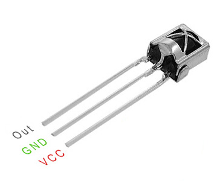
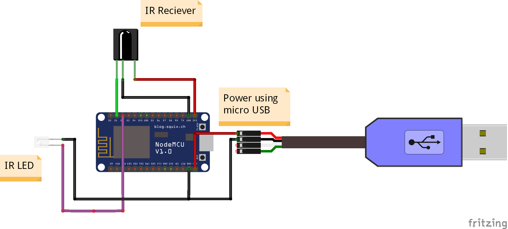

# Make Eufy smart again!

Make a internet enabled IR controller for EUFY vacuum cleaners. Recent models of EUFY and Roomba vacuum cleaners include smartphone control, and my robot was feeling left out. So - lets make EUFY smart again!

## What you need: 

- EUFY vacuum cleaner: [non-internet enabled models v11, v11s and v11+](https://www.eufylife.com/collections/cleaning)
- ESP8266 based microcontroller: we use a [esp8266 12E mounted on a nodeMCU devboard v0.9](https://frightanic.com/iot/comparison-of-esp8266-nodemcu-development-boards/) used here, Adafruit Huzzah or any other internet enabled board can be used too
- Battery pack: Slimmer and bigger mAh is better - current example uses a [12000 mAh battery charger](https://smile.amazon.com/gp/product/B077N9KYV8/ref=oh_aui_detailpage_o03_s00?ie=UTF8&psc=1)
- IR reciever: [VS1838B](https://smile.amazon.com/Haobase-pairs-Infrared-Emission-Receiver/dp/B01EMXC5XA/ref=sr_1_5?ie=UTF8&qid=1528055955&sr=8-5&keywords=ir+led+and+receiver) based. Wiring and further details [here](https://chioszrobots.com/2014/02/11/vs1838-tl1838-vs1838b-universal-infrared-receiving-head-remote-control/)
- IR LED: [950 nm](https://smile.amazon.com/Haobase-pairs-Infrared-Emission-Receiver/dp/B01EMXC5XA/ref=sr_1_5?ie=UTF8&qid=1528055955&sr=8-5&keywords=ir+led+and+receiver) Used like a regular LED
- Misc. supplies: Soldering supplies, wires, proto board, command strip (to mount controller, battery pack)

## Working principle: 

1. This project relies on copying IR codes from the supplied remote, meant for programming EUFY. The idea is to mount a low profile, internet enabled remote on the robot to make it 'smart'. Decoded codes for [Eufy v11](Codes_eufy_v11.txt) are included here. PLEASE PAY ATTENTION TO THE MODEL/ VERSION BEFORE POSTING ISSUES. To avoid issues with revisions/ model differences, please copy the IR codes from supplied remote as discussed shortly. 

2. This project uses the fantastic Blynk project to control board using web requests, and package everything in a nice GUI. Using Blynk servers, we can also enable Google home/ Alexa support using IFTTT. 

3. An IR blaster controlled by esp8266, will replay the codes as if they were coming from EUFY's original remote. 

Here is a step-by-step guide for reading IR codes > designing circuit > coding esp8266 > making Blynk GUI > integrating with IFTTT (and optionally with Google Home)

### Reading IR codes from EUFY's remote: (skip if using EUFY v11 - codes are already included in this project)

All the IR send/ recieve commands are interfaced using cyborg5's amazing [IRLib2](https://github.com/cyborg5/IRLib2). Install it from library manager, or follow instructions on repo's github page. Based on library's example [rawRecv](https://github.com/cyborg5/IRLib2/blob/master/IRLib2/examples/rawRecv/rawRecv.ino), we will be reading IR codes with any arduino based board programmed with ([IR_read_RAW_codes](IR_read_RAW_codes/IR_read_RAW_codes.ino). To equip the IR reciever, simply connect pins to 3.3V, GND and digital pin 2 like follows:



Flash the board with [included code](IR_read_RAW_codes/IR_read_RAW_codes.ino), and open serial monitor with appropriat baud rate. Take your EUFY remote, point it at the reciever, and voila! The code will print the RAW IR code for that particular button. The EUFY's IR reciever is indeed following the exact same procedure to read IR signals from its remote!


For the geeks and nerds out there, most consumer IR signals are carried on a 38kHz carrier frequency, which is also the case here. Some major brands like SONY, NEC and PANASONIC have HEX codes associated with this RAW data, and can be decoded using IRLib2. Since EUFY does not follow any of these standard codes - we will just read and send RAW IR codes - simply an array of numbers representing how long the LEd was ON, followed by how long it was OFF for.

For example, when HOME button is pressed, the raw IR code on serial port is: 

```
Encoding  : UNKNOWN
Code      : E8BEB62D (32 bits)
Timing[83]:
     +2900, -3000     + 500, - 500     + 550, -1400     + 550, -1450
     + 500, - 450     + 550, -1450     + 500, - 450     + 550, - 450
     + 550, - 400     + 550, - 450     + 450, - 550     + 450, - 550
     + 450, - 500     + 550, -1450     + 500, -1450     + 550, -1400
     + 600, -1400     + 550, - 450     + 500, - 450     + 600, - 400
     + 550, - 450     + 500, - 450     + 550, - 450     + 500, - 500
     + 500, - 450     + 450, - 550     + 550, - 450     + 500, - 450
     + 550, - 450     + 550, - 450     + 550, - 450     + 500, - 450
     + 550, - 450     + 550, - 450     + 550, -1400     + 550, -1450
     + 550, -1400     + 450, - 500     + 550, -1450     + 450, -1500
     + 550, -1450     + 550
unsigned int  rawData[83] = {2900,3000, 500,500, 550,1400, 550,1450, 500,450, 550,1450, 500,450, 550,450, 550,400, 550,450, 450,550, 450,550, 450,500, 550,1450, 500,1450, 550,1400, 600,1400, 550,450, 500,450, 600,400, 550,450, 500,450, 550,450, 500,500, 500,450, 450,550, 550,450, 500,450, 550,450, 550,450, 550,450, 500,450, 550,450, 550,450, 550,1400, 550,1450, 550,1400, 450,500, 550,1450, 450,1500, 550,1450, 550};  // UNKNOWN E8BEB62D
```
This denotes a box wave with the led ON for 2900ms, OFF for 3000ms, ON for 500ms, OFF for 450ms and so on. Pressing the same button a couple of times should be used to check consistency of these numbers. Finally, the raw code should be "cleaned" by rounding numbers to obvious extremes: 2900 goes to 3000, 450 and 550 to 500, 1400 to 1500 etc. This is to account for limited resolution. In essence, this same code should have been: 

```
Encoding  : UNKNOWN
Code      : E8BEB62D (32 bits)
Timing[83]:
     +3000, -3000     + 500, - 500     + 500, -1500     + 500, -1500
     + 500, - 500     + 500, -1500     + 500, - 500     + 500, - 500
     + 500, - 500     + 500, - 500     + 500, - 500     + 500, - 500
     + 500, - 500     + 500, -1500     + 500, -1500     + 500, -1500
     + 500, -1500     + 500, - 500     + 500, - 500     + 500, - 500
     + 500, - 500     + 500, - 500     + 500, - 500     + 500, - 500
     + 500, - 500     + 500, - 500     + 500, - 500     + 500, - 500
     + 500, - 500     + 500, - 500     + 500, - 500     + 500, - 500
     + 500, - 500     + 500, - 500     + 500, -1500     + 500, -1500
     + 500, -1500     + 500, - 500     + 500, -1500     + 500, -1500
     + 500, -1500     + 500
unsigned int  rawData[83] = {3000,3000, 500,500, 500,1500, 500,1500, 500,500, 500,1500, 500,500, 500,500, 500,500, 500,500, 500,500, 500,500, 500,500, 500,1500, 500,1500, 500,1500, 500,1500, 500,500, 500,500, 500,500, 500,500, 500,500, 500,500, 500,500, 500,500, 500,500, 500,500, 500,500, 500,500, 500,500, 500,500, 500,500, 500,500, 500,500, 500,1500, 500,1500, 500,1500, 500,500, 500,1500, 500,1500, 500,1500, 500};  // UNKNOWN E8BEB62D
```

[Included codes](Codes_eufy_v11.txt) for EUFY 11 are cleaned and ready to go!

### Circuit for transmitting IR codes using esp8266

The ESP is a wonderful device - packing wifi, digital/ analog IO in such a small footprint is no small feat of engineering. Chinese manufacturers do not get credit for their innovation - ESP is definately an hallmark from Espressif Systems! We will be using a nodeMCU developer board - you can certainly use a esp8266-12E directly if you do not have the board.

Connect everything according to the following circuit:



This is how the final circuit look slike on a proto board: 


